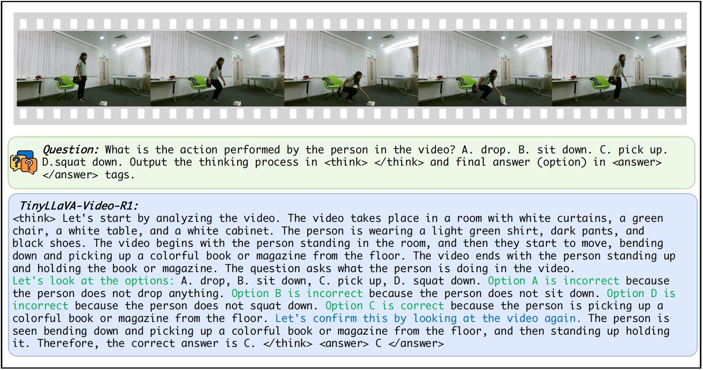
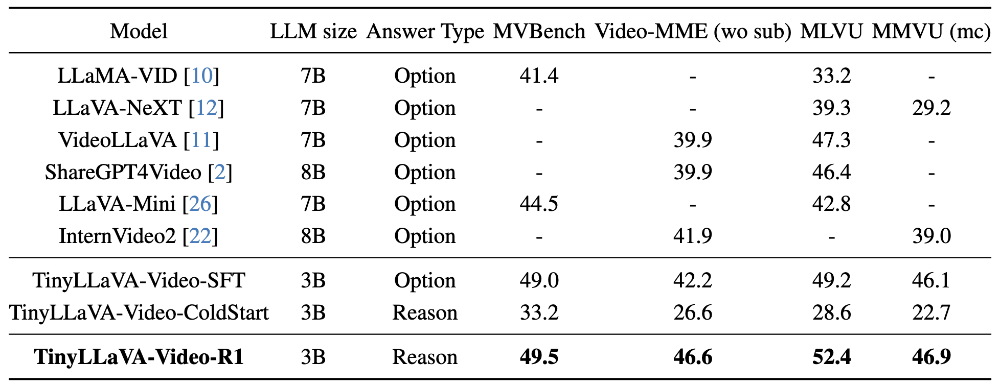

<h2 align="center"> TinyLLaVA-Video-R1</a>

<h5 align="center">
<div align="center">

[Xingjian Zhang](https://scholar.google.com/citations?user=H34fwioAAAAJ&hl=zh-CN)<sup>1*</sup>,
[Siwei Wen](https://scholar.google.com/citations?user=kJRiUYwAAAAJ&hl=zh-CN)<sup>1,2*</sup>,
[Wenjun Wu](https://iai.buaa.edu.cn/info/1013/1093.htm)<sup>1,2,3</sup>, 
[Lei Huang](https://huangleibuaa.github.io/)<sup>1,2,3,✉</sup>

<sup>1</sup>SKLCCSE, Institute of Artificial Intelligence, Beihang University, Beijing, China<br>
<sup>2</sup>Beijing Advanced Innovation Center for Future Blockchain and Privacy Computing, Beihang University, <br>
<sup>3</sup>Hangzhou International Innovation Institute, Beihang University, Hangzhou, China

</div>

<div align="center">

[](https://github.com/ZhangXJ199/TinyLLaVA-Video-R1)
[](https://github.com/ZhangXJ199/TinyLLaVA-Video-R1)
[](https://github.com/ZhangXJ199/TinyLLaVA-Video-R1)

</div>

## 📰 News

##  About
TinyLLaVA-Video-R1 is a small-scale video reasoning model built upon the fully open-source [TinyLLaVA-Video](https://github.com/ZhangXJ199/TinyLLaVA-Video) framework. Designed for researchers with limited computational resources, it leverages reinforcement learning to enhance reasoning abilities while maintaining a model size under 4B parameters. TinyLLaVA-Video-R1 demonstrates improved video question-answering performance and reflective reasoning behaviors ("aha moments"). The model and training process are fully traceable, ensuring reproducibility and reliability. This repository provides the model, code, and experimental setups for easy replication.

<div align="center">

</div>

## 🛠️ Installation

1. Clone this repository and navigate to the folder
```bash
git clone https://github.com/ZhangXJ199/TinyLLaVA-Video-R1.git
cd TinyLLaVA-Video-R1
```

2. Create a conda environment, activate it and install Packages
```Shell
conda create -n tinyllava_video python=3.10 -y
conda activate tinyllava_video
pip install --upgrade pip  # enable PEP 660 support
pip install -e .
```

3. Install additional packages
```Shell
pip install flash-attn --no-build-isolation
```
##### Upgrade to the latest code base

```Shell
git pull
pip install -e .
```

## 📌 Usage

### 1. Data Preparation
We select multiple choice questions from the NextQA subset of [LLaVA-Video-178K](https://huggingface.co/datasets/lmms-lab/LLaVA-Video-178K) as training data. To maintain manageable training time with limited computational resources, we only choose the subset of data with a duration of 0 to 30 seconds, which contains 5,496 samples. The training data can be downloaded from [here](https://huggingface.co/datasets/Zhang199/TinyLLaVA-Video-R1-training-data).

#### Organize Data

Organize the files and annotation files as follows in ``path/to/your/dataset``:

```Shell
dataset
├── NextQA
│   ├── NExTVideo
├── nextqa_0-30s.jsonl
├── nextqa-coldstart-16.json
```

### 2. Train

#### 1. Cold Start

**Option1**: You can directly download [TinyLLaVA-Video-ColdStart](https://huggingface.co/Zhang199/TinyLLaVA-Video-Coldstart_NextQA_16).

**Option2**: You can train the model yourself: 

Replace data paths and model paths with yours in `scripts/train/train_qwen2_coldstart.sh`

```bash
bash scripts/train/train_qwen2_coldstart.sh
```

#### 2. GRPO Training


### 3. Evaluation

We currently provide evaluations on 4 benchmarks, including [Video-MME](https://video-mme.github.io/home_page.html#leaderboard), [MVBench](https://huggingface.co/datasets/OpenGVLab/MVBench), [MLVU](https://github.com/JUNJIE99/MLVU), [MMVU](https://github.com/yale-nlp/MMVU).

#### Video-MME

1. Download [Video-MME](https://huggingface.co/datasets/lmms-lab/Video-MME) and put it under ``path/to/your/dataset/eval/Video-MME``.
2. Please change ``MODEL_PATH``, ``MODEL_NAME``, ``EVAL_DIR``, ``conv-mode`` and ``duration`` in ``scripts/eval/videomme.sh``. There are three types of ``duration`` available for testing: ``short``, ``medium``, and ``long``.
3. Please use the following command for single-gpu inference.
   ```bash
   CUDA_VISIBLE_DEVICES=0 bash scripts/eval/videomme.sh
   ```

#### MVBench

1. Download [MVBench](https://huggingface.co/datasets/OpenGVLab/MVBench) and put it under ``path/to/your/dataset/eval/MVBench``.
2. Please change ``MODEL_PATH``, ``MODEL_NAME``, ``EVAL_DIR`` and ``conv-mode`` in ``scripts/eval/mvbench.sh``.
3. Please use the following command for single-gpu inference.
   ```bash
   CUDA_VISIBLE_DEVICES=0 bash scripts/eval/mvbench.sh
   ```

#### MLVU

1. Download [MLVU](https://huggingface.co/datasets/MLVU/MVLU) and put it under ``path/to/your/dataset/eval/MLVU``.
2. Please change ``MODEL_PATH``, ``MODEL_NAME``, ``EVAL_DIR`` and ``conv-mode`` in ``scripts/eval/mlvu.sh``.
3. Please use the following command for single-gpu inference.
   ```bash
   CUDA_VISIBLE_DEVICES=0 bash scripts/eval/mlvu.sh
   ```

#### MMVU

1. Download [MMVU](https://huggingface.co/datasets/yale-nlp/MMVU) and put it under ``path/to/your/dataset/eval/MMVU``.
2. Please change ``MODEL_PATH``, ``MODEL_NAME``, ``EVAL_DIR`` and ``conv-mode`` in ``scripts/eval/mmvu.sh``.
3. Please use the following command for single-gpu inference.
   ```bash
   CUDA_VISIBLE_DEVICES=0 bash scripts/eval/mmvu.sh

## 📊 Results
The performance of TinyLLaVA-Video-R1 on multiple benchmarks. "Option" indicates that the model only needs to answer with the selected choice, while "Reason" means the model must output both the answer and the reasoning process according to the format requirements. Here, MMVU is categorized as a video reasoning benchmark, the remaining benchmarks are designed for general-purpose video evaluation. The best results are indicated by boldface.

<div align="center">

</div>

The performance of TinyLLaVA-Video-R1 is significantly higher than TinyLLaVA-Video-ColdStart, especially in benchmarks that test reasoning abilities such as MMVU. Moreover, it outperforms TinyLLaVA-Video-SFT across all benchmarks, highlighting the effectiveness of the reinforcement learning approach employed.

##  Aha Moment 

TinyLLaVA-Video-R1 exhibits "aha moments" where it revisits and refines its initial reasoning. As shown in the image below, the model self-corrects by evaluating different options and improving its responses, which enhances accuracy and interpretability. This reflective behavior distinguishes it from traditional models, offering greater transparency in the reasoning process.

<div align="center">

</div>

## 📝 Citation


## 📨 Contact

If you have any questions or suggestions, please feel free to contact us at [zhangxingjian@buaa.edu.cn](zhangxingjian@buaa.edu.cn).

## ❤️ Community efforts
* This repository is based on [TinyLLaVA-Video](https://github.com/ZhangXJ199/TinyLLaVA-Video) project.
* The implementation of the GRPO algorithm refers to the [open-r1-multimodal](https://github.com/EvolvingLMMs-Lab/open-r1-multimodal) project. Great work!
